```{css echo=FALSE}
# This chunk for sequential highlighting
# Label class appropriately for slides that need this
.highlight-last-item > ul > li, 
.highlight-last-item > ol > li {
  opacity: 0.5;
}
.highlight-last-item > ul > li:last-of-type,
.highlight-last-item > ol > li:last-of-type {
  opacity: 1;
}
```

```{r, include = F}
# This is the recommended set up for flipbooks
# you might think about setting cache to TRUE as you gain practice --- building flipbooks from scratch can be time consuming
knitr::opts_chunk$set(fig.width = 6, message = FALSE, warning = FALSE, comment = "", cache = F)
library(flipbookr)
library(tidyverse)
```
# Grammar of Graphics
.pull-right[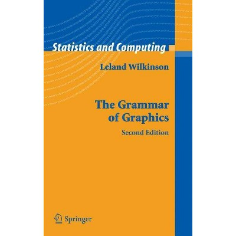]
.pull-left[
- First published in 1999
  - Foundation for many graphic applications

- Grammar can be applied to every type of plot

- Concisely describe components

- Construct and deconstruct
]
---
# Grammar of Graphics
.footnote[Source: ggplot2 workshop by @thomasp85]

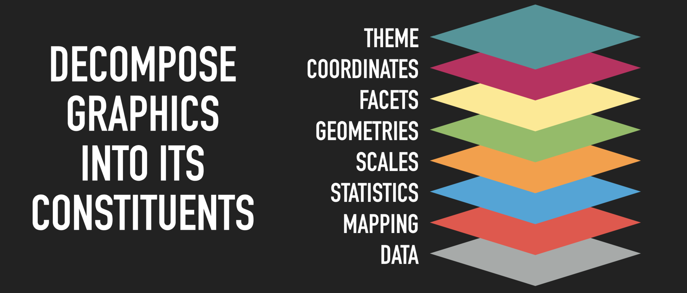
---
# Grammar of Graphics
.footnote[Source: ggplot2 workshop by @thomasp85]

.pull-right[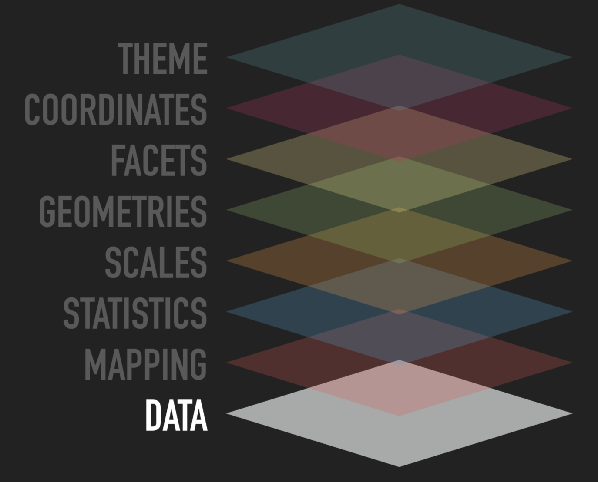]

- Your dataset

- Tidy format

---
# Grammar of Graphics

.footnote[Source: ggplot2 workshop by @thomasp85]

.pull-right[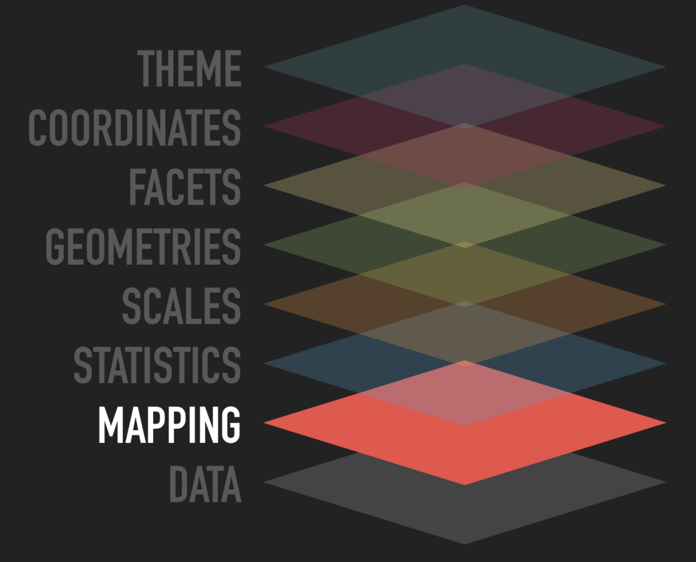]

- This is how we tell R which variables we want to plot

- *Aesthetics mapping*   
Links variable in the data to graphical properties

- *Facets mapping*   
Links variable in data to panels in the plot layout
---
# Grammar of Graphics
.footnote[Source: ggplot2 workshop by @thomasp85]

.pull-right[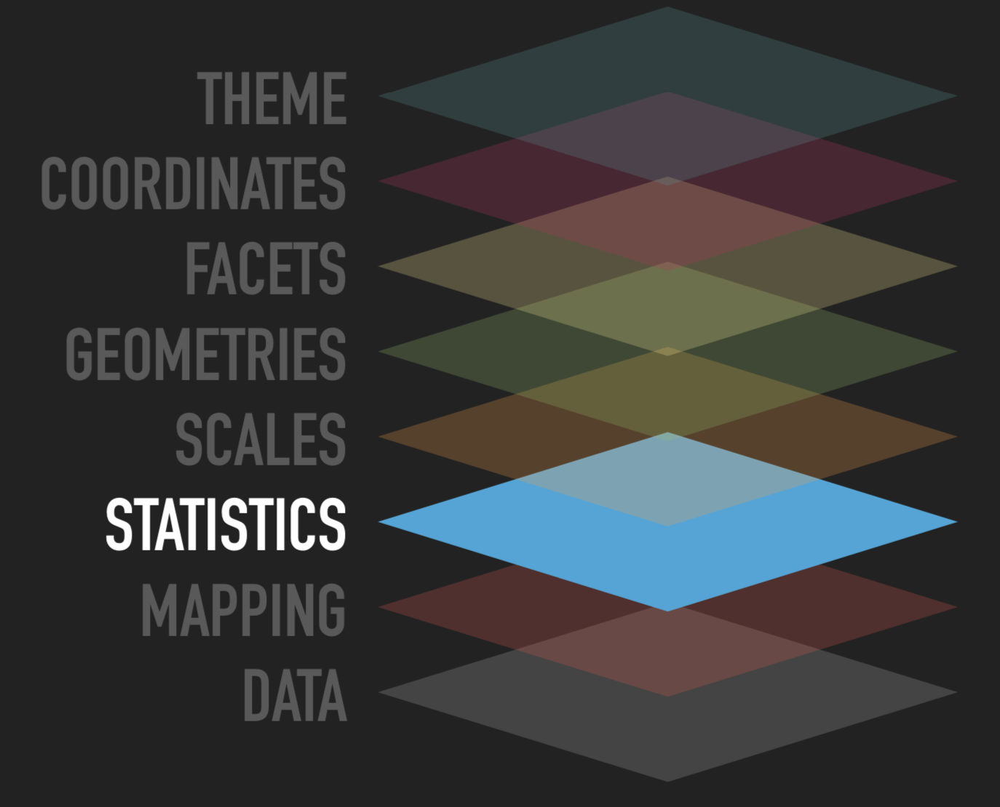]

- Even tidy data may need some transformation

- Transform input variables to displayed values
  - Bins for histogram
  - Summary statistics for boxplot
  - No. of observations in a category for bar chart
  
- Implicit in many plot types 
---
# Grammar of Graphics
.footnote[Source: ggplot2 workshop by @thomasp85]
.pull-right[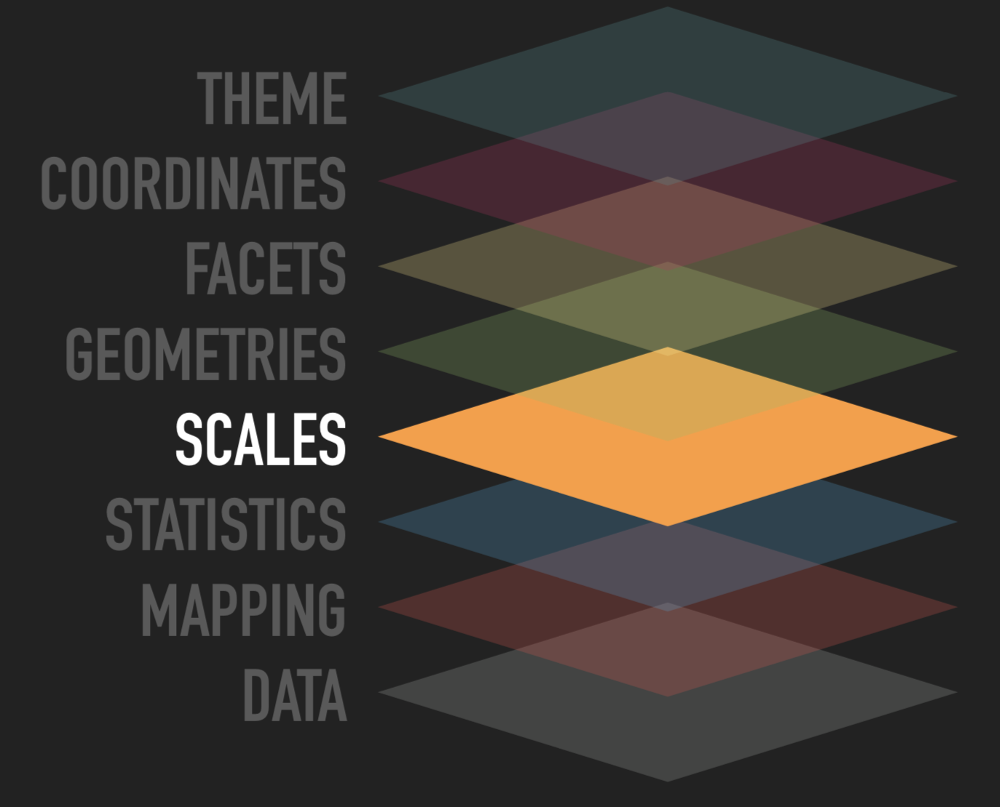]

- Help you interpret the plot
  - Categories -> color
  - Numeric -> position

- Automatically generated in ggplot and can be customized
  - log scale
  - time series

---
# Grammar of Graphics
.footnote[Source: ggplot2 workshop by @thomasp85]

.pull-right[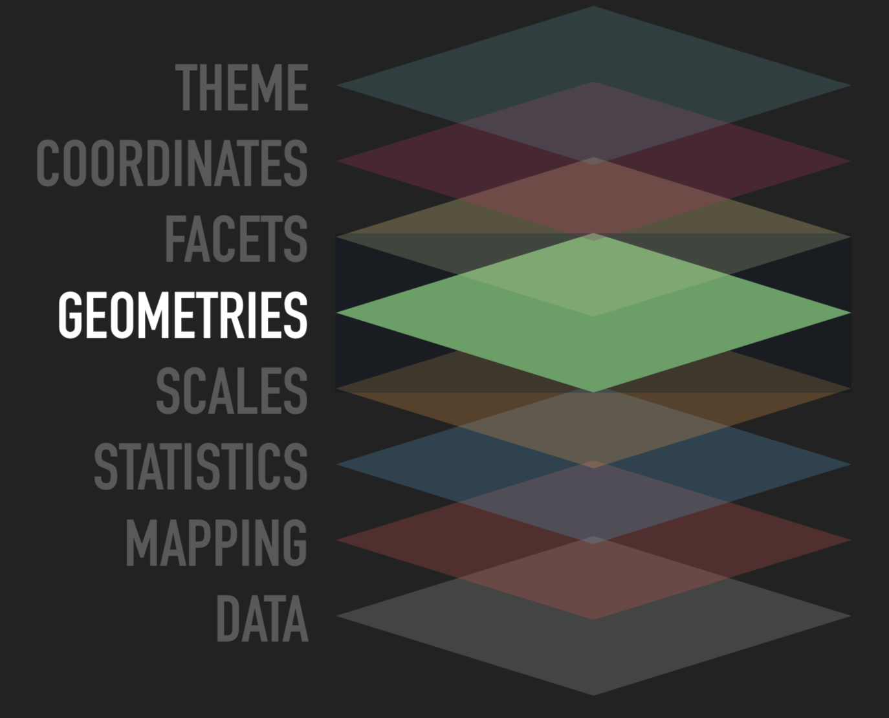]

- Aesthetics as graphical repersentations

- Determines your plot type
  - bar chart
  - scatter
  - boxplot
  - ...

---

# Grammar of Graphics
.footnote[Source: ggplot2 workshop by @thomasp85]

.pull-right[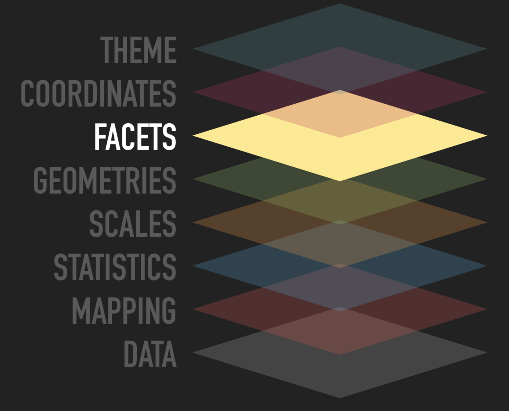]

- Divide your data into panels using one or two groups

- Allows you to look at smaller subsets of data

---
# Grammar of Graphics
.footnote[Source: ggplot2 workshop by @thomasp85]

.pull-right[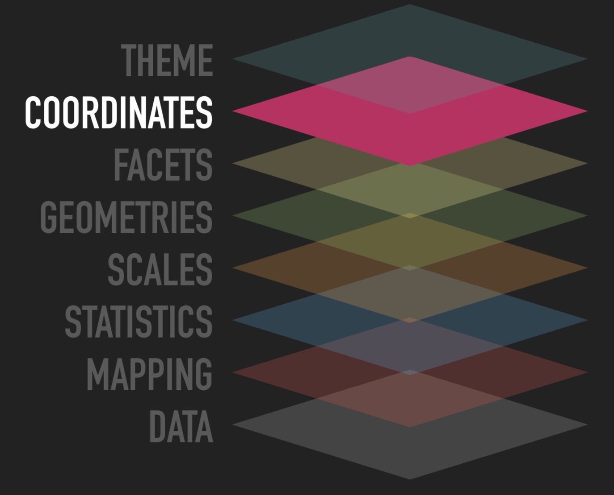]

- Positions are interpreted by the coordinate system

- Defines the physical mapping of the aesthetics 

---
# Grammar of Graphics
.footnote[Source: ggplot2 workshop by @thomasp85]

.pull-right[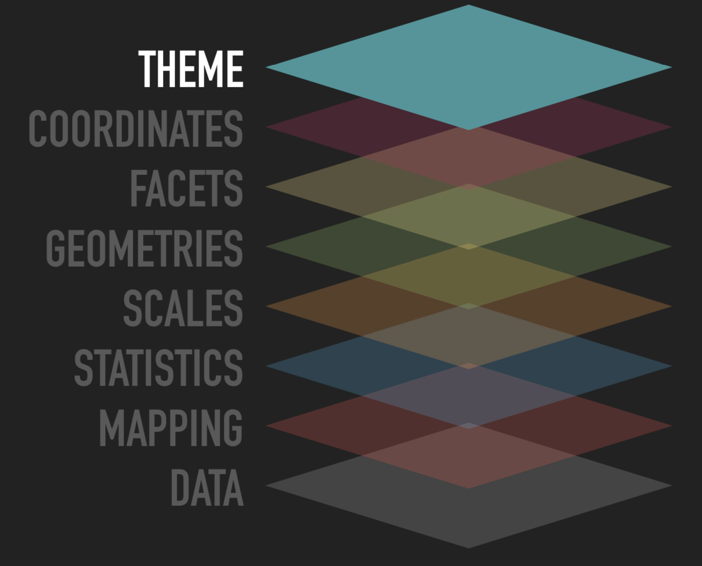]

- Overall look of the plot

- Spans every part of the graphic that is not linked to the data
  - "non-data ink"
  
---

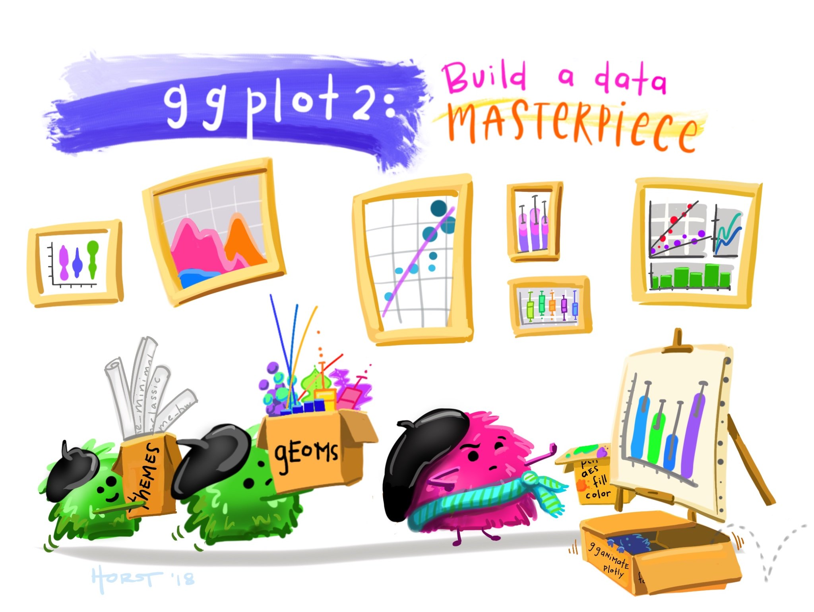

---
# Getting Started
- Load the tidyverse package
```{r eval=FALSE}
library(tidyverse)
```

- If this is your first time you may have to install it first
```{r eval=FALSE}
install.packages("tidyverse")
library(tidyverse)
```

---
class: center, middle

## Do cars with big engines use more fuel than cars with small engines?

---
# Data set `mpg`

Observations collected by US EPA on 38 models of cars

```{r}
head(ggplot2::mpg)
```

- `displ` : car's engine size

- `hwy` : car's fuel efficiency on the highway in miles per gallon

- type `?mpg` to learn more about the dataset

???
a car with low fuel efficiency consumes more fuel than a car with high fuel efficiency for the same distance


---
```{r my_cars, include = FALSE, echo=TRUE}
ggplot(data=mpg)+ #BREAK
  aes(x=displ)+#BREAK2
  aes(y=hwy)+#BREAK3
  geom_point()
```

`r chunk_reveal("my_cars", break_type = "auto", title="#Your first ggplot")`
---

#What did we need?
.footnote[Source: ggplot2 workshop by @thomasp85]
.pull-right[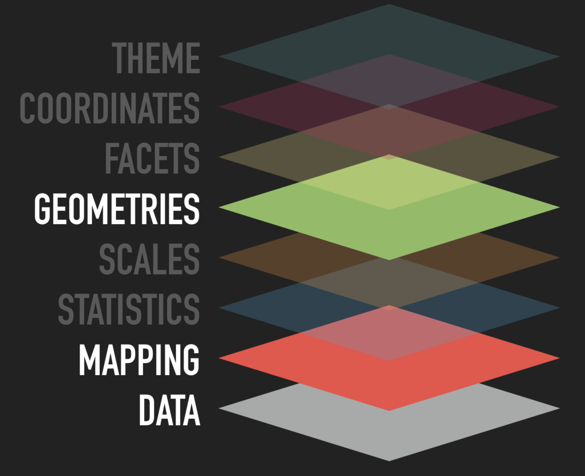]

--

.center[
.pull-left[
##All other components use defaults
]
]
---
class:middle
# A template
###`ggplot(data = <DATA>) +`  
###`<GEOM_FUNCTION> (mapping = aes(<MAPPINGS>))`
--

`ggplot(data=mpg)+ 
  geom_point(mapping= aes(x=displ, y=hwy))`
--
---
# Common Problems

- Make sure that every `(` is matched with a `)` 

- Make sure that every `"` is paired with another `"`

- Make sure that `+` is in the right place: it has to come at the end of the line, not the start. The following code will **not work**

```{r eval=FALSE}
ggplot(data = mpg) 
+ geom_point(mapping = aes(x = displ, y = hwy))
```

- Look for help by typing `?function_name`
  - scroll down to examples
  
- Look at the error message  
  - *try googling the error message*


???
As you start to run R code, you’re likely to run into problems. Don’t worry — it happens to everyone. I have been writing R code for years, and every day I still write code that doesn’t work! Start by carefully comparing the code that you’re running to the code in the book. R is extremely picky, and a misplaced character can make all the difference.
---
####*Let's look at the plot again*

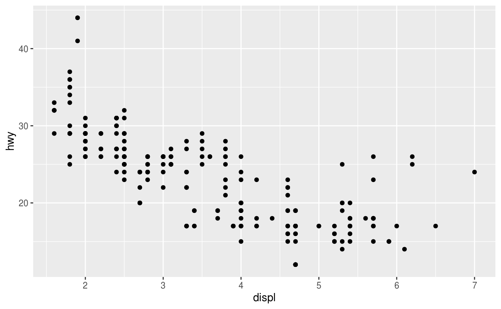
---
```{r my_cars3, include = FALSE, echo=TRUE}
ggplot(data=mpg)+ #BREAK
  aes(x=displ)+#BREAK
  aes(y=hwy)+#BREAK
  aes(color=class)+ #BREAK2
  geom_point() #BREAK
                 
```

`r chunk_reveal("my_cars3", break_type = "non_seq", title="#Aesthetics")`

---
```{r my_cars4, include = FALSE, echo=TRUE}
ggplot(data=mpg)+ #BREAK
  aes(x=displ)+#BREAK
  aes(y=hwy)+#BREAK
  aes(shape=class)+ #BREAK2
  geom_point() #BREAK
                 
```

`r chunk_reveal("my_cars4", break_type = "non_seq", title="#Aesthetics")`

---
# Aesthetics
Setting the properties of `geom` manually
```{r fig.height=4}
ggplot(data = mpg) + 
  geom_point(mapping = aes(x = displ, y = hwy), color = "blue") #<<
```

--

Here, the color "blue" doesn’t convey information about a variable, but only changes the appearance of the plot
---
# Aesthetics

To set a geometric property manually, place it outside of `aes()`

- The name of a color as a character string

- The size of a point in mm

- The shape of a point as a number

--


*R has 25 built in shapes that are identified by numbers*
---
# Aesthetics


Remember aesthetics depend on geometry...
---
# Geometric Objects

.pull-left[

]  
.pull-right[
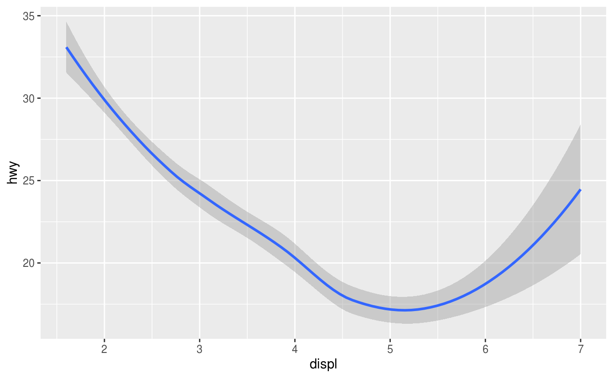
]
  
Both plots have the same `x` and `y` axes but use different `geoms` or geometries
--
???
Plots are often described as their geoms as boxplots, line plots, etc.
often described as their geoms as boxplots, line plots, etc.

---
```{r line, include=FALSE, echo=TRUE}
ggplot(data = mpg) + #BREAK
  geom_smooth(mapping = aes(
                  x = displ, 
                  y = hwy, 
                  linetype = drv))
```

`r chunk_reveal("line", break_type = "auto", title="#Geometric objects")`

---


```{r geoms, include=FALSE, echo=TRUE}
ggplot(data = mpg) + #BREAK
  geom_point(mapping = aes(
    x = displ, 
    y = hwy)) + #BREAK2
  geom_smooth(mapping = aes(
    x = displ, 
    y = hwy)) 

```

`r chunk_reveal("geoms", break_type = "auto", title="##Mulitple geoms")`
---

```{r geoms2, include=FALSE, echo=TRUE}
ggplot(data = mpg, 
       mapping = aes
       (x = displ, 
         y = hwy)) + #BREAK
  geom_point() + #BREAK2
  geom_smooth()

```
`r chunk_reveal("geoms2", break_type = "auto", title="##Mulitple geoms")`
???
If you place mappings in a geom function, ggplot2 will treat them as local mappings for the layer. It will use these mappings to extend or overwrite the global mappings for that layer only. This makes it possible to display different aesthetics in different layers.
---
```{r geoms3, include=FALSE, echo=TRUE}
ggplot(data = mpg, 
       mapping = aes(
         x = displ, 
         y = hwy)) + #BREAK
  geom_point(
    mapping = aes(
      color = class)) + #BREAK2
  geom_smooth()

```
`r chunk_reveal("geoms3", break_type = "auto", title="##Mulitple geoms")`
---
##Where to place `aes()`

- If `aes()` function is placed inside ggplot(), the same `aes` is used for all layers

- If `aes()` is placed outside ggplot() function then its definition is used for the specific layer

- Multiple `aes()` can be defined for multiple geometries within the same plot
---
```{r geoms4, include=FALSE, echo=TRUE}
ggplot(data = mpg,
       mapping = aes(
         x = displ, 
         y = hwy)) + #BREAK 
  geom_point(
    mapping = aes(
      color = class)) + #BREAK2
  geom_smooth(data = 
                filter(mpg, 
                       class == "suv"), 
              se = FALSE) 

```
`r chunk_reveal("geoms4", break_type = "auto", title="#Mulitple geoms")`
---
class:inverse, middle, center
#Exercises
---
# Statistical Transformations

.pull-right[]
.pull-left[
- Linked to geometries

- Every `geom` has a default `stat` and vice versa

- Can use `geom_*()` and `stat_()*` interchangeably but former is more common
]
---
# Statistical Transformations

```{r fig.width=5, fig.height=4}
ggplot(data = diamonds) + 
  geom_bar(mapping = aes(x = cut))
```

--

Where does count on y-axis come from?
---
# Statistical Transformations

.pull-left[
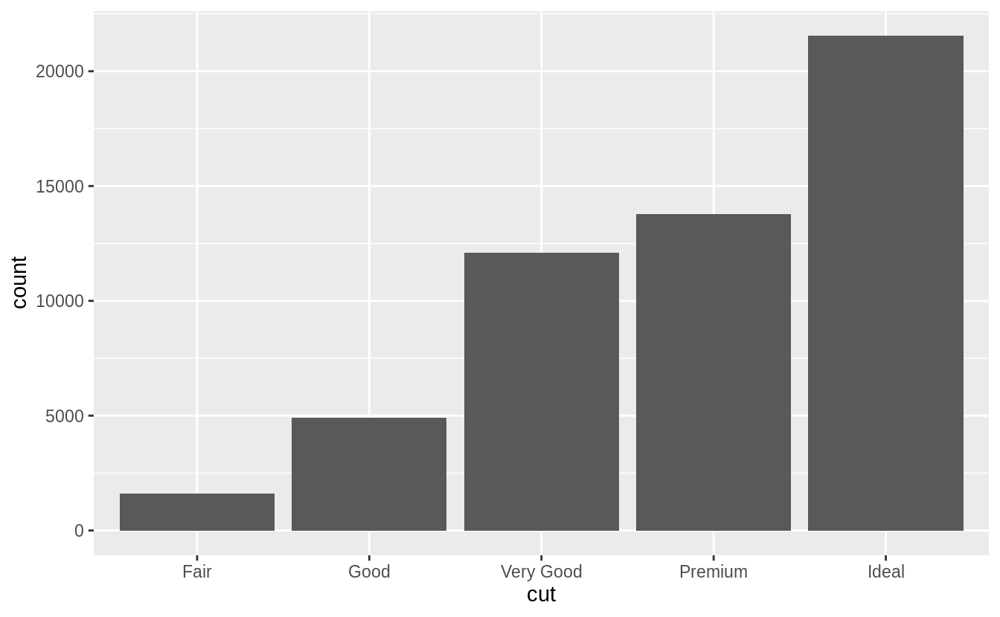
]
.pull-right[

Some plots calculate new values from the data 
- Bar charts and histograms  

- smoothing functions 

- boxplots 
]

--

The algorithm used to calculate new values for a graph is called a **stat**, short for statistical transformation

---
# Statistical Transformations


You can find out which `stat` each `geom` uses by looking at the default value of the `stat` argument of the help page.

What it the default `stat` for `geom_bar`?
---

# Statistical Transformations

- Overriding default options  
- Here, display bar chart of proportions instead of count


```{r fig.width=5, fig.height=4}
ggplot(data = diamonds) + 
  geom_bar(mapping = aes(x = cut, y = stat(prop), #<<
                         group = 1))
```

---
#Scales
.footnote[Source: ggplot2 workshop by @thomasp85]

.pull-right[]
.pull-left[

- Everything inside `aes()` will have a scale by default

- `scale_<aesthetic>_<type>()`

- `<type>` can either be a generic (continuous, discrete, or binned) or specific (e.g. area, for scaling size to circle area)
]
---
# Scales

```{r fig.height=5}
ggplot(mpg) +
  geom_point(aes(x = displ, y = hwy, colour = class))
```
---
# Scales

```{r fig.height=5}
ggplot(mpg) +
  geom_point(aes(x = displ, y = hwy, colour = class))+
  scale_colour_brewer(type = 'qual') #<<
```

---
#Scales
```{r fig.height=5}
ggplot(mpg) +
  geom_point(aes(x = displ, y = hwy)) +
  scale_x_continuous(breaks = c(3, 5, 6)) + #<<
  scale_y_continuous(trans = 'log10') #<<
```
---
# Facets
.footnote[Source: ggplot2 workshop by @thomasp85]
.pull-right[]

.pull-left[
- Split data into multiple panels

- Another way to add additional variable

- Useful for categorical variables

- Facet by a single variable `facet_wrap()`

- Facet by two variables `facet_grid()`
]
---
```{r facets, include = FALSE, echo=TRUE}
ggplot(data = mpg) + #BREAK
  geom_point(mapping = aes(
    x = displ,
    y = hwy)) + #BREAK
  facet_wrap(~ class, nrow = 2)
```

`r chunk_reveal("facets", break_type = "auto", title="#Facets")`
---
```{r facets2, include=FALSE, echo=TRUE}
ggplot(data = mpg) + #BREAK
  geom_point(mapping = aes(
    x = displ, 
    y = hwy)) + #BREAK
  facet_grid(drv ~ cyl)
```
`r chunk_reveal("facets2", break_type = "auto", title="#Facets")`
---
class:inverse, middle, center
#Exercises
---
# Coordinates
.footnote[Source: ggplot2 workshop by @thomasp85]
.pull-right[]

.pull-left[
- Defining your plot canvas
  - How should x and y be interpreted?
  
- Default is  the Cartesian coordinate system

- Useful for spatial data (map projections)
]
---
```{r coord, include=FALSE, echo=TRUE}
ggplot(data = mpg, 
       mapping = aes(
         x = class, 
         y = hwy)) + #BREAK
  geom_boxplot() + #BREAK2
  coord_flip()

```
`r chunk_reveal("coord", break_type = "auto", title="#Coordinate Systems")`
---
# Themes
.footnote[Source: ggplot2 workshop by @thomasp85]
.pull-right[]
.pull-left[
- Style changes that are not related to data

- Can apply built-in themes or modify each element separately

- Follows hierarchy i.e. changes in the upper level percolate to lower levels 
]

---
```{r themes1, include = FALSE, echo=FALSE, eval=FALSE}
ggplot(data=mpg)+ 
  aes(x=displ)+
  aes(y=hwy)+ 
  geom_point()+ #BREAK
  theme_classic() + #ROTATE
  theme_minimal() + #ROTATE
  theme_dark() #ROTATE
```

`r chunk_reveal("themes1", break_type = "rotate", title="#Themes")`

---
#Themes
```{r fig.height=3.5, fig.width=6}
ggplot(data=mpg, aes(x=displ, y=hwy))+geom_point()+
  theme(
    panel.grid.major = element_line('white',size = 0.5),
    panel.grid.minor = element_blank(),
    panel.grid.major.y = element_blank(),
    panel.border = element_rect(colour = "blue", fill = NA, linetype = 2),
    panel.background = element_rect(fill = "aliceblue"),
    axis.title = element_text(colour = "blue", face = "bold", family = "Times"),
    axis.text=element_text(face="bold")
  )
```

???
Check out `ggthemes` package for many more theme options
---
``` {r lables1, include=FALSE, echo=TRUE}
ggplot(data=mpg)+ #BREAK
  aes(x=displ)+ #BREAK
  aes(y=hwy)+ #BREAK
  geom_point()+#BREAK
  theme_minimal()+  #BREAK2
  labs(x="Displacement")+  #BREAK
  labs(y="Highway Mileage")+  #BREAK3
  labs(title="My first GGPLOT")+  #BREAK4
  labs(subtitle="This is the subtitle")+  #BREAK5
  labs(caption="Source:mpg dataset")
```  
`r chunk_reveal("lables1", break_type = "auto", title="##Adding labels to your plot")`
---
``` {r lables2, include=FALSE, echo=TRUE}
myplot <- ggplot(data=mpg)+ 
  aes(x=displ)+
  aes(y=hwy)+
  geom_point()+#BREAK
  theme_minimal()  #BREAK2

myplot+#BREAK3
  labs(x="Displacement")+  #BREAK4
  labs(y="Highway Mileage")+  #BREAK5
  labs(title="My first GGPLOT")+  #BREAK6
  labs(subtitle="This is the subtitle")+  #BREAK7
  labs(caption="Source:mpg dataset")
```

`r chunk_reveal("lables2", break_type = "auto", title="##ggplot object")`
---
# A `ggplot` template
`ggplot(data = <DATA>) + `  
 ` <GEOM_FUNCTION>(`  
     `mapping = aes(<MAPPINGS>),`  
     `stat = <STAT>,`   
    ` position = <POSITION>`  
  `) +`  
 ` <COORDINATE_FUNCTION> +`  
  `<FACET_FUNCTION>`  
  
*In practice, you rarely need to supply all seven parameters to make a graph because ggplot2 will provide useful defaults for everything except the data, the mappings, and the geom function.*
---

class: inverse, middle, center

# BEYOND ggplot2
How to better compose, annotate and highlight your plots

---

---
# Plot Composition with `patchwork`

```{r, fig.height=5, fig.width=12 }
library(ggplot2)
library(patchwork)
p1 <- ggplot(mpg) + geom_point(aes(displ, hwy)) # first plot
p2 <- ggplot(mpg) + geom_boxplot(aes(displ, hwy, group = class)) # second plot 
p1+p2 # combined plot output using patchwork package
```

---
# Plot Composition with `patchwork`
```{r, fig.height=5, fig.width=12, warning=FALSE, message=FALSE}
p3 <- ggplot(mpg, aes(displ, hwy))+geom_point(aes(color=class))+geom_smooth(aes(color=class))
p4 <- ggplot(mpg) + geom_bar(aes(class))
p5<-(p1 | p2 | p3) / p4 #<<
p5+plot_annotation('This is a title', caption = 'Source: mpg dataset',
                   theme = theme(plot.caption = element_text(size = 14),
                                 plot.title = element_text(size = 18)))
```
---
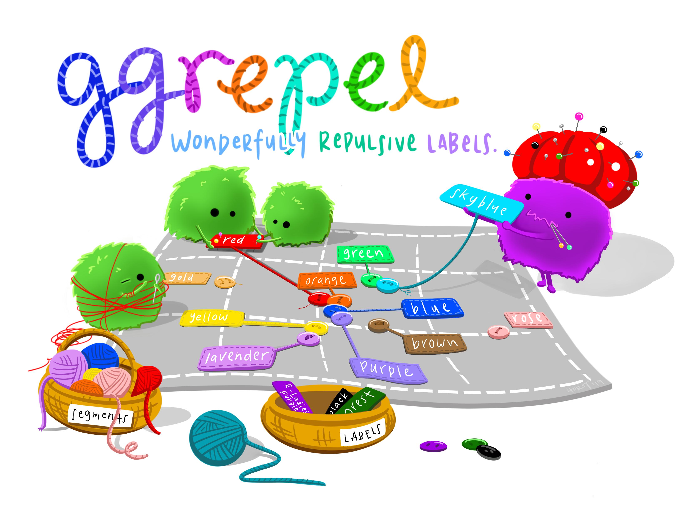
---
# Plot Annotation without `ggrepel`
```{r fig.height=5}
ggplot(mpg[1:20,], aes(x = displ, y = hwy)) +
  geom_point() +
  geom_text(aes(label = model)) #<<
```
---
# Plot Annotation with `ggrepel`
```{r fig.height=5}
library(ggrepel) #<<
ggplot(mpg[1:20,], aes(x = displ, y = hwy)) +
  geom_point() +
  geom_text_repel(aes(label = model)) #<<
```
---
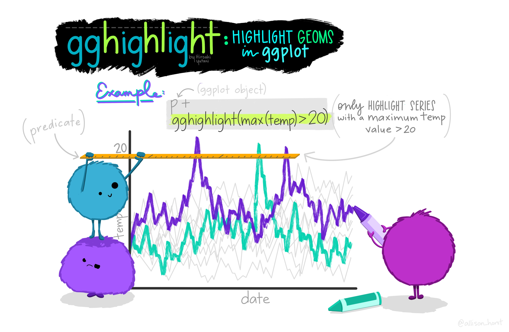
---
```{r highlight1, include=FALSE, echo=TRUE}
library(gghighlight)
ggplot(airquality)+ #BREAK
  geom_line(aes(Day, Temp, 
                color=factor(Month)))+
  theme_bw()+
  labs(x = "Day of Month", 
       y = "Temperature") +
  theme(legend.position = "top")+
  gghighlight(max(Temp) > 93, 
              label_key = Month)
  
```

`r chunk_reveal("highlight1", break_type = "auto", title="#Highlighting geoms")`
---
# What next?

- `ggplot2` [extensions](https://exts.ggplot2.tidyverse.org/gallery/)
- Rstudio [cheatsheet](https://rstudio.com/wp-content/uploads/2015/03/ggplot2-cheatsheet.pdf)
- BBC Visual and Data Journalism [cookbook for R graphics](https://bbc.github.io/rcookbook/)
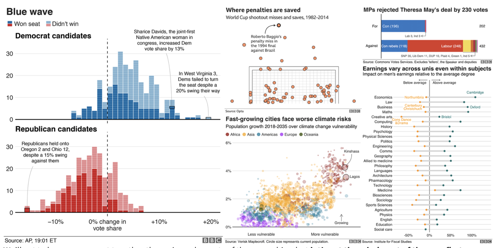
---

class:middle, center

#`openair` package

---
# Input data type
- The date/time field should be named `date` 
- The wind speed and wind direction should be named `ws` and `wd` respectively
- If you have data from more than one site include a column named `site`
???
The principal reason for insisting on specific input data
format is that there will be less that can go wrong and it is easier to write code for a
more limited set of conditions.
---
#`summaryPlot`
```{r fig.height=5, fig.width=7}
library(openair) # load openair
data(mydata) ## make sure data that comes with openair is loaded
summaryPlot(mydata[,1:5]) # summary of nox and wind data
```
???
 The plots in the left panel show the time series data, where blue shows the presence of data and red missing
data. The daily mean values are also shown in pale yellow scaled to cover the range in the data
from zero to the maximum daily value. As such, the daily values are indicative of an overall
trend rather than conveying quantitative information. For each pollutant, the overall summary
statistics are given. For each year the percentage data capture is shown in green font. The
panels on the right show the distribution of each species using a histogram plot
---
# `windRose`
```{r fig.height=5, fig.width=5}
library(openair)
windRose(mydata)
```
---
#`windRose`
Use `type=` to group your data for plotting
.pull-left[
```{r fig.height=4, fig.width=6}
library(openair)
windRose(mydata, type = "year", #<<
         layout = c(4, 2))
```
]

--
.pull-right[
```{r fig.height=4, fig.width=6}
library(openair)
windRose(mydata, type = "pm10", #<<
         layout = c(4, 1))
```
]
---
#`calendarPlot`
.pull-left[
```{r fig.height=5.5}
library(openair)
calendarPlot(mydata, pollutant = "o3", 
             year =2003)
```
]
--

.pull-right[
```{r fig.height=5.5}
library(openair)
calendarPlot(mydata, pollutant = "o3", 
             year = 2003, annotate = "ws") #<<
```
]
---
class: middle, center
###Explore more using the `openair` package manual  
https://davidcarslaw.com/files/openairmanual.pdf
---
#Resources Used

- [`flipbookr`](https://github.com/EvaMaeRey/flipbookr) package by Gina Reynolds

- [`xaringan`](https://github.com/yihui/xaringan) package by Yihui Xie

- [R for Data Science](https://r4ds.had.co.nz/) book by Hadley Wickham & Garrett Grolemund

- [`ggplot2` workshop](https://www.youtube.com/watch?v=h29g21z0a68) by Thomas Lin Pedersen

- [Illustrations](https://github.com/allisonhorst/stats-illustrations) by Allison Horst
---
class: inverse, middle, center

# THANK YOU


